# configuration-cache

KubeCon EU 2026 — [Intelligent Control Plane Demo](https://sched.co/2CVzm)

This Crossplane configuration package demonstrates AI-driven cache management on Azure, showcasing two capabilities:

- **Intelligent Assistance**: AI diagnoses stuck resources and annotates root cause + remediation steps
- **Intelligent Control**: AI auto-remediates misconfigurations and optimizes costs — with human authorization

## Architecture

```mermaid
sequenceDiagram
    participant SRE
    participant Crossplane
    participant AI as AI Controller
    participant Azure

    SRE->>Crossplane: ./demo.sh setup<br/>(demo-stuck ardId=ARD-MISSING, demo-costly sku=xl)
    Crossplane->>Azure: reconcile → stuck (no ResourceGroup match)

    rect rgb(40, 60, 80)
        Note over SRE,AI: Stage 2 — Intelligent Assistance
        SRE->>Crossplane: ./demo.sh before-1
        Crossplane-->>SRE: Unready conditions, cryptic events — no context
        AI->>Crossplane: watches Cache, detects stuck state
        AI->>Crossplane: annotate diagnosis + last-diagnosed
        SRE->>Crossplane: ./demo.sh after-1
        Crossplane-->>SRE: cache.mbcp.cloud/diagnosis = root cause + steps
    end

    rect rgb(40, 70, 50)
        Note over SRE,Azure: Stage 3 — Intelligent Control (Remediation)
        SRE->>Crossplane: ./demo.sh remediate<br/>(sets allow-auto-remediation=true)
        AI->>Crossplane: watches label → patches spec.parameters.ardId
        AI->>Crossplane: annotate auto-remediated
        Crossplane->>Azure: reconcile with correct ardId → cache recovers
    end

    rect rgb(70, 50, 30)
        Note over SRE,Azure: Stage 4 — Cost Optimization
        SRE->>Crossplane: ./demo.sh cost-before
        Crossplane-->>SRE: sku=xl, no cost context
        AI->>Crossplane: analyzes usage → annotate cost-recommendation
        SRE->>Crossplane: ./demo.sh cost-after
        Crossplane-->>SRE: cache.mbcp.cloud/cost-recommendation = downscale to s
        SRE->>Crossplane: ./demo.sh cost-optimize<br/>(sets allow-cost-optimization=true)
        AI->>Crossplane: watches label → patches spec.parameters.sku
        AI->>Crossplane: annotate cost-optimized
        Crossplane->>Azure: reprovision at lower SKU
    end
```



## Demo Flow

### Prerequisites

- A running Upbound control plane with the `configuration-cache` package installed
- `kubectl` configured against the control plane
- Azure provider configured as `ClusterProviderConfig/azure-provider`

### Full Demo

**Terminal A** (live watch):
```bash
./demo.sh watch
```

**Terminal B** (demo commands):
```bash
# Create the two demo Cache XRs
./demo.sh setup
```

#### Stage 2 — Intelligent Assistance

```bash
# Show raw Crossplane noise: stuck resources, no context
./demo.sh before-1

# Show AI diagnosis: root cause + remediation steps in annotations
./demo.sh after-1
```

`demo-stuck` is created with `ardId: ARD-MISSING` — no ResourceGroup will match. The AI diagnoses the mismatch and writes the root cause into `cache.mbcp.cloud/diagnosis`.

#### Stage 3 — Intelligent Control (Remediation)

```bash
# Authorize the AI to patch ardId automatically
./demo.sh remediate
```

Sets `allow-auto-remediation=true` on `demo-stuck`. The AI patches `spec.parameters.ardId` to the correct value and annotates `cache.mbcp.cloud/auto-remediated`. Crossplane reconciles and the cache recovers.

#### Stage 4 — Cost Optimization (Assistance + Control)

```bash
# Show xl cache with no cost context
./demo.sh cost-before

# Show AI cost analysis and downscale recommendation
./demo.sh cost-after

# Authorize the AI to downscale the SKU
./demo.sh cost-optimize
```

`demo-costly` runs at `sku: xl`. The AI annotates a cost recommendation. After `allow-cost-optimization=true` is set, the AI patches the SKU and the cache reprovisions at the lower tier.

#### Cleanup

```bash
./demo.sh cleanup
```

## Demo Resources

| Resource | ardId | SKU | Purpose |
|---|---|---|---|
| `demo-stuck` | `ARD-MISSING` | `s` | Stuck resource — diagnosis + remediation demo |
| `demo-costly` | `ARD-001` | `xl` | Over-provisioned — cost analysis + optimization demo |

## AI Annotations

The AI controller writes results into `cache.mbcp.cloud/` annotations:

| Annotation | Set by | Description |
|---|---|---|
| `cache.mbcp.cloud/last-diagnosed` | Stage 2 | Timestamp of last diagnosis |
| `cache.mbcp.cloud/diagnosis` | Stage 2 | Root cause and remediation steps |
| `cache.mbcp.cloud/auto-remediated` | Stage 3 | Confirms ardId was patched |
| `cache.mbcp.cloud/cost-analysis-timestamp` | Stage 4 | Timestamp of cost analysis |
| `cache.mbcp.cloud/cost-recommendation` | Stage 4 | Downscale recommendation |
| `cache.mbcp.cloud/cost-optimized` | Stage 4 | Confirms SKU was patched |

## Authorization Labels

Human-in-the-loop gates before the AI takes action:

| Label | Required for |
|---|---|
| `allow-auto-remediation=true` | Stage 3 — ardId auto-patch |
| `allow-cost-optimization=true` | Stage 4 — SKU downscale |

## Commands Reference

```
./demo.sh setup          # create demo Cache XRs
./demo.sh before-1       # show raw Crossplane noise (the pain)
./demo.sh after-1        # show AI diagnosis annotation (the relief)
./demo.sh watch          # live watch pane (run in separate terminal)
./demo.sh remediate      # authorize AI to auto-fix ardId
./demo.sh cost-before    # show xl cache with no context
./demo.sh cost-after     # show AI cost recommendation
./demo.sh cost-optimize  # authorize AI to downscale
./demo.sh cleanup        # delete demo resources
```
